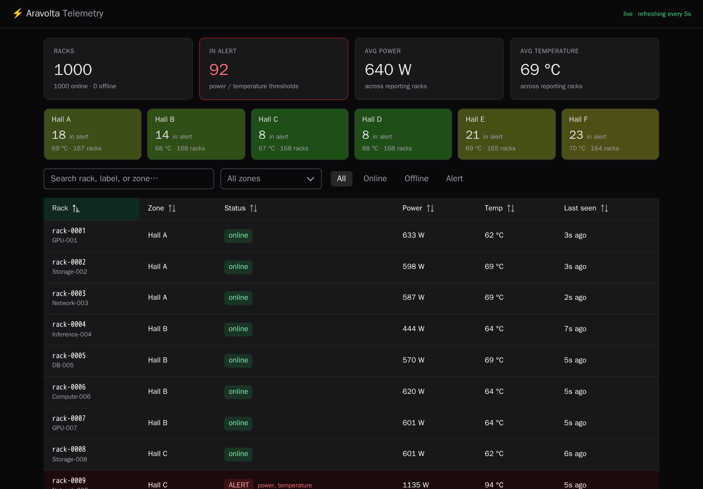
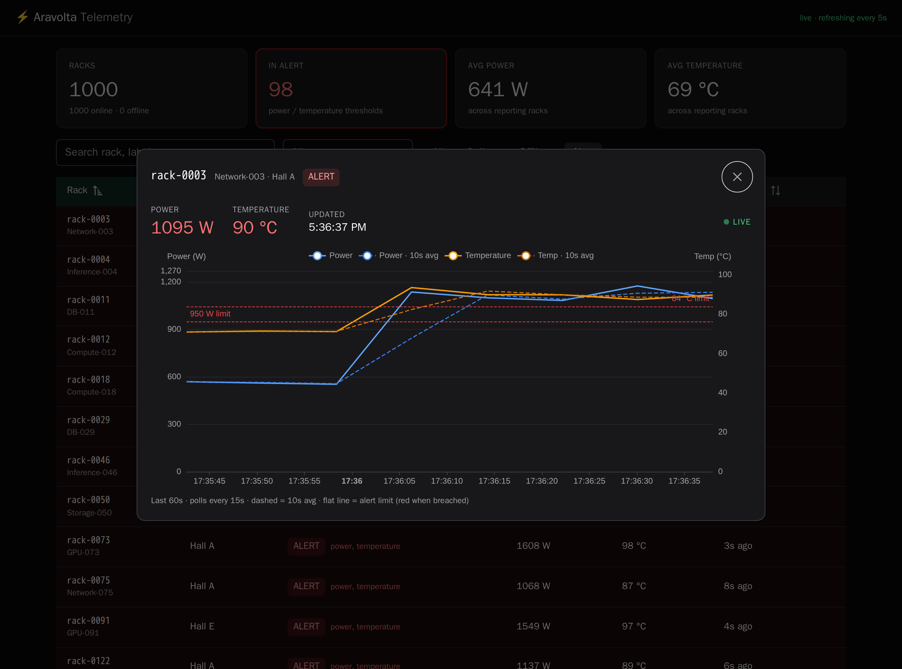

# Aravolta — Live Device Telemetry Dashboard & API

A live telemetry dashboard + ingestion API for a data center with thousands of racks reporting power and temperature telemetry data.

Stack: **FastAPI · TimescaleDB · Dragonfly (Redis-compatible cache) · Vue 3 +
PrimeVue + ECharts**.



Clicking a rack opens a live detail panel with that rack's per-device alert
limits drawn on the chart (red when breaching):



---

# Architecture

## How I handle ingestion load

The ingest endpoint `POST /api/metrics` validates the payload, does an O(1) 
`queue.put_nowait()` onto an in-process buffer, and returns 202 Accepted without directly 
touching the database. A separate background task does the actual writing. This ensures the 
accept path has constant length and low latency regardless of how slow (or
briefly unavailable) the database is.

The buffer is bounded to prevent OOM issues. If the writer can't keep up and the buffer fills, 
the endpoint returns 503 (load-shedding / backpressure) instead of growing memory
until the process dies. The 503 is important because it tells a client device
that it needs to back off and retry. This is a tradeoff because it will cause some
ingestion to be delayed and need a retry, but it is better than losing the entire buffer.

## Batching / queueing / buffering strategy

- Buffer: an in-process `asyncio.Queue` (bound by `queue_max`).
- One batch-writer task drains it. It collects up to `batch_max_size` rows
  or waits `batch_max_interval_ms` and if either hits the threshold writes the
  whole batch with a single Postgres `COPY`. Batching amortizes the fixed
  per-operation costs like the network round-trip and transaction commit across
  hundreds of rows.
- The same flush also registers new devices once per batch (not per row) and
  write-throughs the latest reading per device into the cache.
- The cache write uses an atomic Lua compare-and-set: with multiple workers,
  two flushes for one device can land out of order, so I only overwrite the cached
  "latest" if the incoming timestamp is newer. This prevents and older reading from
  removing a new one and losing data on the live telemetry charts.

## Tradeoffs

- **In-process buffer** (vs. an external broker like Kafka): For the scope of this takehome
  this was simple to implement and scales well up to 1k devices on my laptop's VM, but it is process local. 
  A crash loses whatever's buffered, and backpressure is per-worker, not global. 
  In production I'd move the buffer to Kafka (see scaling). I chose the simple version because simply
  vertically scaling one machine could probably handle 50k devices at 15s interval (3.3k writes / second)
  without being too expensive as you add workers to the API.
- **No ORM on the hot path** (raw `asyncpg` + `COPY`): speed and explicitness over
  convenience.
- **No foreign key / surrogate PK on `metrics`**: both cost an extra write per row
  on the hottest table for no benefit here; device integrity is enforced in the app
  via upsert-on-first-sight.
- **Server-side pagination for reads:** the browser only ever holds one page, but
  each read request does an O(N) merge of the roster + cache (`_snapshot`). Fine at
  ~1k; at 50k it needs maintained counters / a search index instead.
- **PostgresSQL's TimescaleDB**: To efficiently ingest and store time series data it is 
  ideal to use a database specifically suited to it. A choice like InfluxDB for its ability
  to do time based partitions and column based compression to keep query speeds fast
  and avoid the quantity of data becoming to large for the database. I am not familiar
  with InfluxDB so I went with the TimescaleDB extension for Postgres to achieve similar
  benefits.

## High-level data flow

```
                  ingest (fast, non-blocking)                 store (slow, batched)
 racks ── POST /api/metrics ──▶ FastAPI ──put_nowait()──▶ asyncio.Queue ──▶ batch writer
          {deviceId,power,          │ 202                 (bounded buffer)      │
           temperature,ts}          │                                          │ ≤500 rows
                                    ▼                                          │ OR 250 ms
                                (validate)                        ┌────────────┴───────────┐
                                                            COPY  ▼                        ▼  write-through (CAS)
                                                       TimescaleDB (hypertable)       Dragonfly (latest/device)
                                                                 ▲                        ▲
 browser ◀─ poll 5s/15s ─ GET /api/devices (page) · /:id/metrics (window) │  /:id/live · /api/summary │
```

1. Racks POST readings → API validates and buffers → returns 202.
2. Batch writer flushes to TimescaleDB (`COPY`) and updates the cache.
3. The browser reads the fleet page and time-window history from Postgres while it takes
   the latest-per-device values and fleet summary from the cache. Reads are
   served on a different path from writes, so heavy reads don't slow ingestion.

## Database schema

```sql
devices (
  device_id   TEXT PRIMARY KEY,   -- natural key from the payload
  label       TEXT,               -- role, e.g. "GPU-001"
  location    TEXT,               -- hall / zone within the DC
  power_limit REAL,               -- per-device alert limits (NULL -> fleet default)
  temp_limit  REAL,
  created_at  TIMESTAMPTZ
)

metrics (                         -- append-only time-series, a Timescale HYPERTABLE
  device_id   TEXT,
  ts          TIMESTAMPTZ,        -- reading time (the partitioning column)
  power       REAL,
  temperature REAL
)
-- index (device_id, ts DESC) makes both hot reads cheap:
--   "last 60s for device X"  and  "latest reading for device X"
```

`metrics` is a hypertable which Timescale automatically partitions it into time based
chunks so old data drops a whole chunk instantly and "last 60s" queries only scan
the newest chunk. Alert limits live in the `devices` table, per device so any rack 
or hardware type can carry its own power/thermal statistical limits.

## How the system handles high-frequency writes

- Batched `COPY` as opposed to per-row `INSERT` is the fastest bulk path into Postgres.
  One round-trip / transaction / WAL flush per batch instead of per row.
- The hypertable keeps writes hitting the newest chunk and its index small.
- Reads don't compete with writes: the read-hot "latest per device" and fleet
  summary are served from the cache, not the write table.
- Measured on my laptop's VM: a single-node batched `COPY` sustains ~693,000 rows/s
  (see below) so the storage layer is not the constraint.

## Scaling to 50,000+ devices

At the take home's proposed 15-second cadence, 50k devices ≈ 3,300 writes/s, 
which a single batched writer handles comfortably. What matters is cadence × devices. 
So, tier by tier:

- **API tier** — stateless workers behind a load balancer; scale horizontally.
  Each worker owns its own buffer + writer (independent capacity).
- **Durability + burst absorption** — replace the in-process buffer with Kafka,
  partitioned by `deviceId`. Producers acknowledge only once the record is on disk +
  replicated; consumers batch-write and replay from their offset on crash. Kafka
  can absorb spikes in traffic and close the durability gap.
- **Storage** — Timescale compression (telemetry compresses ~10×), retention
  policies (auto-drop old chunks), and continuous aggregates (pre-rolled
  per-minute rollups that power the summary + heatmap without scanning raw data).
  Past one node you could start sharding by `deviceId`.
- **Reads** — already server-side paginated with a server-side aggregate endpoint,
  so the browser holds one page. At 50k, replace the per-request O(N) `_snapshot`
  with maintained counters / continuous aggregates.

## What would break first

I ran a test with `backend/loadtest.py` on a shared 4-core sandbox on my macbook air
where the API, load generator, Postgres and Dragonfly all contend for the same cores, so the absolute
numbers are conservative but ratios can still inform what would break first.

| Measurement | Result |
|---|---|
| Raw DB `COPY` ceiling (4 conns × 1000-row batches) | **~693,000 rows/s** |
| End-to-end HTTP ingest, 1 API worker | **~415 req/s** |
| Backpressure: 20-slot buffer under 200 concurrent clients | **1,426 accepted, 148 shed (503), 0 crashes** |

1. **The compute / write-acceptance tier breaks first.** On real infrastructure the
   fix is horizontal API workers. Proving horizontal scaling cleanly needs the load 
   generator on a separate** machine and workers on dedicated cores which I don't have
   on hand right now as I am doing this on my laptop's VM.
2. **Then the single Postgres write path** (WAL / disk / index maintenance) under
   sustained extreme load — addressed by compression and sharding.
3. **Durability gap** —  the in process buffer is lost on crash, so at a larger scale
it might be worth using Kafka to ensure reliability when the buffer is frequently full.
